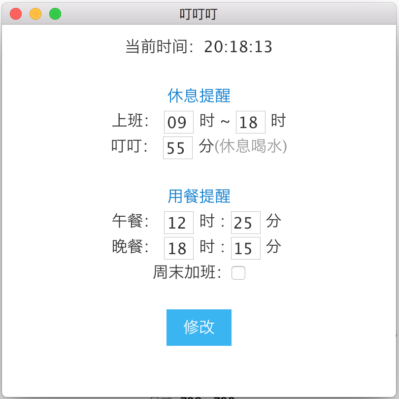

# OfficeAlarm
一个PC桌面应用，设置办公室闹钟提醒，定时喝水、休息、吃饭等。

## 软件截图


## 下载体验
- [Mac版](https://github.com/kylingo/OfficeAlarm/releases/tag/v1.0.1)
- [Windows版](http://pjnr4vk1h.bkt.clouddn.com/alarm/OfficeAlarm-win32-x64.zip)

## 环境搭建
依赖
```
// 以mac环境为例
brew install ruby
brew install node
brew install npm
npm config set registry https://registry.npm.taobao.org
npm install -g cnpm --registry=https://registry.npm.taobao.org
npm install electron --save-dev
```

运行
````
// 进入app目录
npm start
or
electron app
````

打包
```
// 打包前，先安装electron-packager
npm install electron-packager --save-dev
// 在pack目录，执行打包
npm run-script packager

// windows安装包依赖
brew tap caskroom/cask
brew cask install java xquartz
brew install wine

// Mac环境打包
electron-packager ../app OfficeAlarm --out ./output --platform=darwin --arch=x64 --version 1.0.0 --overwrite --icon=../app/assets/img/icon_app.icns

// 生成DMG文件
安装[appdmg](https://github.com/LinusU/node-appdmg)
拷贝pack/dmg目录的文件，到pack/output/OfficeAlarm-darwin-x64中
appdmg appdmg.json OfficeAlarm.dmg
````

## 参考资料
- [electron打包](https://segmentfault.com/a/1190000011908324)

- [electron-api-demos-Zh_CN](https://github.com/demopark/electron-api-demos-Zh_CN)

- [WebStorm ES6 语法支持设置](http://www.jianshu.com/p/b4390919a5b5)

## Issue
- Electron Packager requires Node 4.0 or above.
    - brew install nodebrew
    - npm  install  -g  n
    - n 8.11.4
